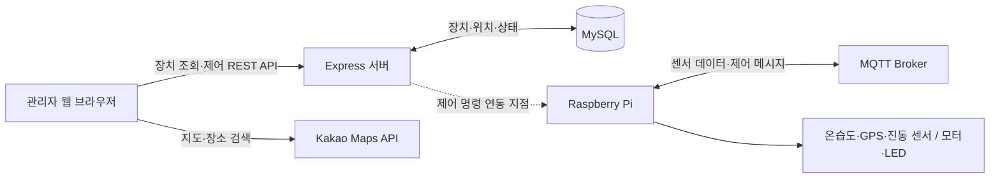

[git_Linc_SunShade.pdf](https://github.com/user-attachments/files/16792754/git_Linc_SunShade.pdf)
# Smart SunShade

> Raspberry Pi와 웹 대시보드를 연결해 여러 스마트 그늘막의 위치와 상태를 확인하고, 차양막 및 조명을 원격 제어하는 IoT 통합 관제 시스템입니다.


## 프로젝트 개요

Smart SunShade는 지역별로 분산된 스마트 그늘막을 지도에서 한눈에 확인하고 관리하기 위한 서비스입니다. 관리자는 장치의 위치와 운영 주체를 검색하거나 정렬할 수 있으며, 차양막과 두 개의 LED를 장치별 또는 다중 선택 방식으로 제어할 수 있습니다.

전체 프로젝트는 Raspberry Pi 기반 센서·모터 제어 영역과 웹 관제 영역으로 구성됩니다. 이 저장소에는 React 관제 화면과 Express·MySQL 서버 코드가 포함되어 있습니다.

| 항목 | 내용 |
| --- | --- |
| 개발 기간 | 2024.03 ~ 2024.08 |
| 개발 인원 | 2명 |
| 주요 목적 | 스마트 그늘막의 상태 확인 및 원격 통합 제어 |
| 관제 대상 | 차양막 모터, LED 1, LED 2 |
| 주요 지역 데이터 | 시·도, 시·군·구, 읍·면·동, 설치 장소, 위도·경도 |

## 주요 기능

### 지도 기반 장치 관제

- 카카오맵에 장치의 위도·경도를 기반으로 커스텀 마커 표시
- 마커 선택 시 사이드바의 해당 장치로 자동 스크롤 및 강조
- 장치 선택 시 해당 위치로 지도 중심 이동
- 버튼을 이용한 지도 확대·축소

### 검색 및 정렬

- 장치 번호, 설치 장소, 행정구역, 관리자 기준 검색
- 카카오 로컬 API를 이용한 장소 키워드 검색 및 페이지네이션
- 장소, 시·도, 시·군·구, 읍·면·동, 관리자, 장치 번호 기준 정렬
- 검색 결과에 맞춰 지도 마커와 표시 범위 동기화

### 원격 제어

- 장치별 차양막, LED 1, LED 2 상태 변경
- 여러 장치를 선택해 특정 설비를 일괄 On/Off
- 전체 장치 일괄 On/Off
- 제어 전 Redux 상태와 DB 상태를 비교해 중복 명령 방지
- 제어 결과를 DB와 클라이언트 상태에 반영하고 토스트 메시지 제공

## 시스템 구성



### 제어 흐름

1. 사용자가 장치 또는 다중 제어 버튼을 선택합니다.
2. 서버의 `POST /api/getPower`로 DB와 화면의 상태가 일치하는지 확인합니다.
3. 변경 가능한 상태라면 Redux 상태와 DB 상태를 갱신합니다.
4. `Control.js`에서 장치 제어 인터페이스에 전달할 명령 값을 생성합니다.
5. 성공·중복·오류 결과를 토스트 메시지로 안내합니다.

> 현재 저장소의 `Control.js`에는 장치로 HTTP 요청을 보내는 코드가 연동 지점으로 마련되어 있으나 실제 요청 부분은 주석 처리되어 있습니다. Raspberry Pi 또는 MQTT 게이트웨이의 주소와 규격에 맞춰 연결해야 합니다.

## 기술 스택

| 구분 | 기술 |
| --- | --- |
| Frontend | React 18, Redux Toolkit, React Router, Reactstrap, React Bootstrap, CSS Modules |
| Map | Kakao Maps JavaScript API, Kakao Local Places API |
| Backend | Node.js, Express |
| Database | MySQL, express-mysql-session |
| IoT | Raspberry Pi, Python, MQTT, DHT22, GPS, 진동 센서, 모터 제어 |
| Communication | REST API, MQTT Publish/Subscribe |

## 담당 역할 및 기술적 개선

- Raspberry Pi 기반 스마트 그늘막 프로토타입 제작
- DHT22 온습도, GPS, 진동 센서 데이터 수집 로직 구현
- 웹 제어 명령 수신 후 차양막 모터를 펼치거나 접는 제어 로직 구현
- MQTT Publish/Subscribe 방식으로 센서 데이터와 제어 명령 연동
- 0.5초마다 발생하는 원시 센서 값을 그대로 전송하던 구조를 **10초 단위 평균값 전송**으로 개선
- 불필요한 메시지 전송량과 화면 수치 변동을 줄여 관제 화면의 안정성과 가독성 향상

## REST API

기본 주소는 `http://localhost:3001/api`입니다.

| Method | Endpoint | 설명 | Request Body |
| --- | --- | --- | --- |
| `GET` | `/getDevice` | 장치, 위치, 소유사, 전원 상태 조회 | 없음 |
| `GET` | `/getOwner` | 장치 소유사 정보 및 마커 이미지 조회 | 없음 |
| `POST` | `/getPower` | 특정 장치의 차양막·LED 상태 조회 | `{ "device_num": "1" }` |
| `POST` | `/changePower` | 특정 장치의 설비 상태 반전 후 DB 저장 | `{ "device_num": "1", "thing": "sunshade_power", "on_off": 0 }` |

`thing`에는 `sunshade_power`, `led_power`, `led2_power` 중 하나를 사용합니다.

### 장치 제어 값

`Control.js`가 생성하는 장치 제어 값은 다음과 같습니다.

| 대상 | 동작 | 전송 필드 | 값 |
| --- | --- | --- | --- |
| 차양막 | 펼치기 | `powerValue` | `1` |
| 차양막 | 접기 | `powerValue` | `2` |
| LED 1 | 켜기 | `ledValue` | `3` |
| LED 1 | 끄기 | `ledValue` | `4` |
| LED 2 | 켜기 | `led2Value` | `5` |
| LED 2 | 끄기 | `led2Value` | `6` |

## 데이터베이스 구성

이 저장소에는 보안을 위해 DB 접속 파일과 세션 설정 파일이 포함되어 있지 않습니다. 다음 테이블과 컬럼을 기준으로 서버 쿼리가 동작합니다.

| 테이블 | 주요 컬럼 | 용도 |
| --- | --- | --- |
| `device_info` | `device_num`, `ip_address`, `latitude`, `longitude`, `sunshade_power`, `led_power`, `led2_power` | 장치 기본 정보 및 전원 상태 |
| `device_owner` | `device_num`, `device_owner` | 장치와 운영 주체 연결 |
| `device_area` | `device_num`, `area` | 장치와 설치 장소 연결 |
| `area` | `area`, `sido_nm`, `sigungu_nm`, `dong_nm` | 행정구역 정보 |
| `owner` | `device_owner`, `owner_image`, `phone_num` | 운영 주체 및 지도 마커 이미지 |

전원 상태 컬럼은 `0`을 Off, `1`을 On으로 사용합니다.

## 프로젝트 구조

```text
Linc_SunShadeWeb-main/
├── map_control/                 # React 관제 웹
│   ├── public/
│   └── src/
│       ├── Function/
│       │   └── Control.js       # 장치 제어 명령 변환 및 연동 지점
│       ├── layouts/
│       │   ├── views/MapPage.js # 카카오맵 및 장치 마커
│       │   └── Sidebar.js       # 검색·정렬·개별/다중 제어
│       ├── redux/               # 장치·소유사·지도 전역 상태
│       └── routes/
└── server/                      # Express API 서버
    ├── server.js
    ├── DBRoutes.js
    ├── userDBControl.js
    └── dbSql.js
```

## 실행 방법

### 1. 사전 준비

- Node.js 18 LTS 이상
- MySQL 8.x
- Kakao Developers에서 발급한 JavaScript 키

### 2. 서버 설정

`server/db.js`를 생성합니다.

```js
const mysql = require("mysql2");

const db = mysql.createConnection({
  host: process.env.DB_HOST,
  port: Number(process.env.DB_PORT || 3306),
  user: process.env.DB_USER,
  password: process.env.DB_PASSWORD,
  database: process.env.DB_NAME,
});

module.exports = db;
```

`server/sessionOption.js`를 생성합니다.

```js
module.exports = {
  host: process.env.DB_HOST,
  port: Number(process.env.DB_PORT || 3306),
  user: process.env.DB_USER,
  password: process.env.DB_PASSWORD,
  database: process.env.DB_NAME,
};
```

DB 환경변수를 설정한 후 서버 의존성을 설치합니다.

```bash
cd server
npm install
node server.js
```

서버는 기본적으로 `http://localhost:3001`에서 실행됩니다.

> 서버 코드가 `mysql2`를 사용하도록 구성한 경우 `npm install mysql2`가 추가로 필요합니다. 현재 저장소의 `db.js`는 보안상 제외되어 있으므로 실제 사용 중인 MySQL 드라이버에 맞춰 작성하세요.

### 3. 프론트엔드 설정

`map_control/.env.development.local`을 생성합니다.

```env
REACT_APP_DB_HOST=http://localhost:3001
REACT_APP_KAKAO_JS_KEY=YOUR_KAKAO_JAVASCRIPT_KEY
REACT_APP_KAKAO_PLUS_IMG=YOUR_ZOOM_IN_IMAGE_URL
REACT_APP_KAKAO_MINUS_IMG=YOUR_ZOOM_OUT_IMAGE_URL
```

의존성을 설치하고 개발 서버를 실행합니다.

```bash
cd map_control
npm install
npm start
```

웹 애플리케이션은 기본적으로 `http://localhost:3000`에서 실행됩니다.

## 구현 상태 및 참고 사항

- React 개발 서버의 API 프록시는 `http://localhost:3001`로 설정되어 있습니다.
- Express CORS 허용 주소는 현재 `http://localhost:3000`으로 고정되어 있습니다.
- `server/db.js`와 `server/sessionOption.js`는 민감정보 보호를 위해 `.gitignore`에 포함되어 있습니다.
- 실제 장치 제어 요청은 `map_control/src/Function/Control.js`에서 Raspberry Pi 또는 MQTT 게이트웨이 규격에 맞게 연결해야 합니다.
- 운영 환경에서는 API 입력값 검증, SQL 파라미터 바인딩, 인증·권한 확인을 추가하는 것을 권장합니다.

## 프로젝트 자료

- [프로젝트 발표 자료](https://github.com/user-attachments/files/16792754/git_Linc_SunShade.pdf)
